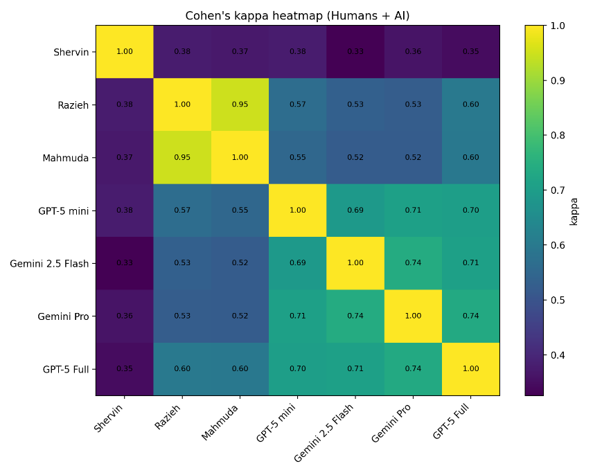
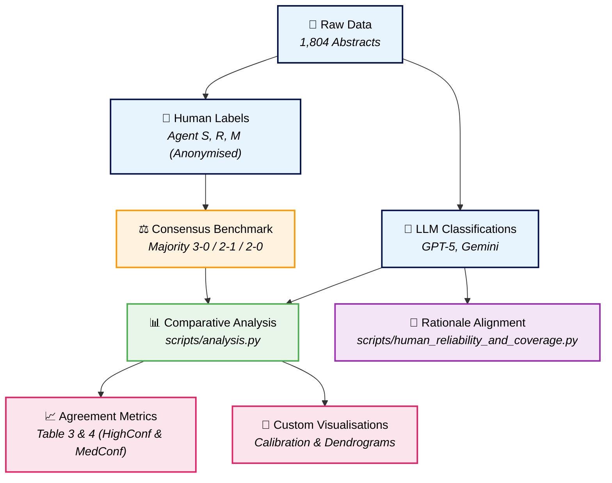
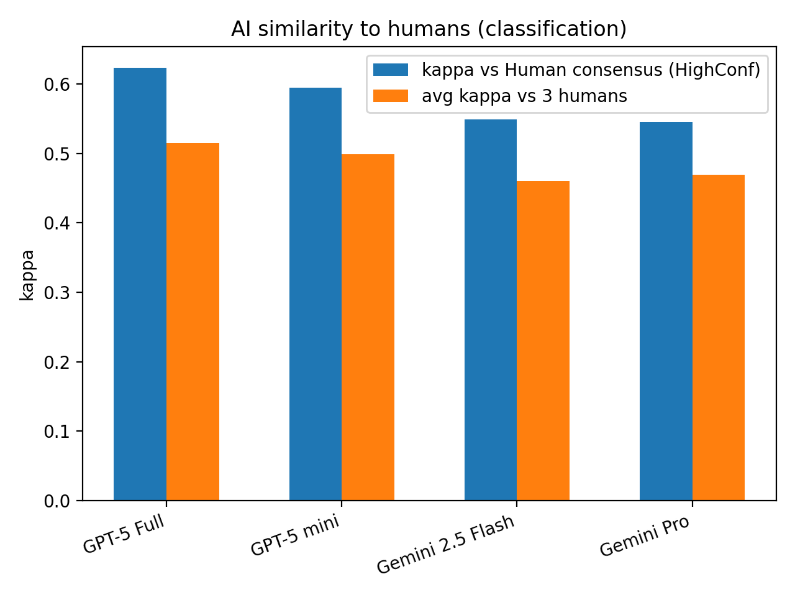
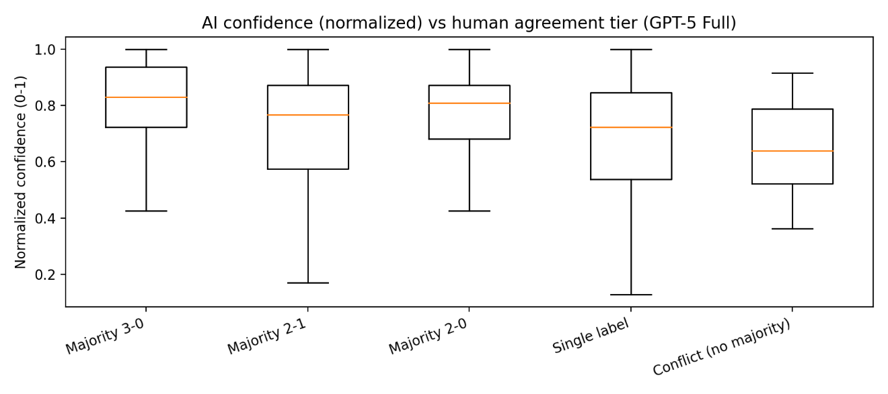
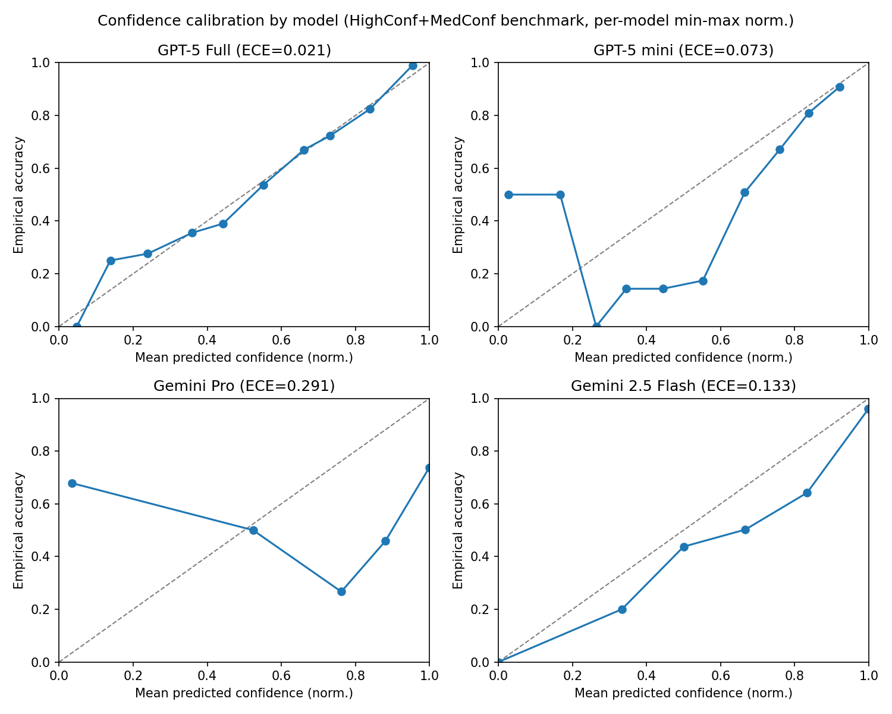
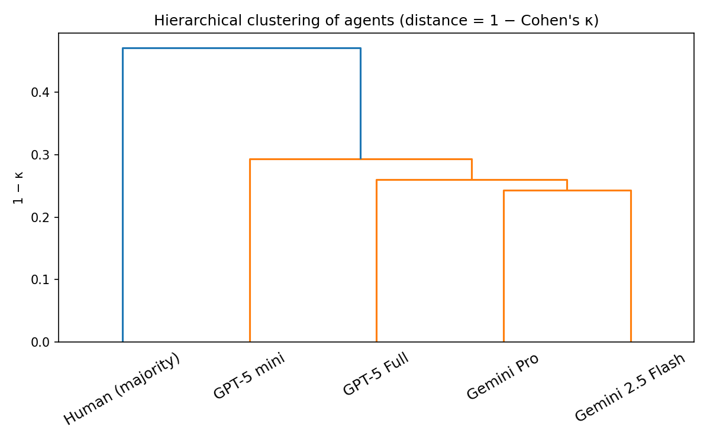

<div align="center">

# Evaluating the Agreement Between Large Language Models and Human Reviewers in Classifying Construction Research

### A Quantitative Agreement Study and Rationale Alignment Analysis

[]()
[](https://opensource.org/licenses/MIT)


<br>



<br>

*A replication package and dataset evaluating chance-corrected agreement, semantic rationale consistency, and confidence-based routing between state-of-the-art LLMs and consensus human annotators in classifying construction-industry research.*

</div>

---

<table>
<tr>
<td width="55%">

**M. Reza Hosseini** ¹ · **Ania Khodabakhshian** ² · **Abdolmajid Erfani** ³

¹ Faculty of Architecture, Building and Planning, The University of Melbourne, Melbourne, VIC 3010, Australia
² Department of Architecture, Built Environment and Construction Engineering, Politecnico di Milano, Milan, Italy
³ Department of Civil, Environmental, and Geospatial Engineering, Michigan Technological University, Houghton, MI 49931, USA

</td>
<td width="45%">

**Status:** Under Review / Pre-print · DOI — pending

**Corpus:** 1,804 construction research abstracts using a 6-class taxonomy

**Anonymisation:** Agent S, Agent R, Agent M (fully compliant with double-blind review)

</td>
</tr>
</table>

---

## Why This Project?

The rapid expansion of artificial intelligence (AI) and machine learning (ML) within the construction domain makes systematic literature screening increasingly labor-intensive. Large Language Models (LLMs) offer a promising avenue to automate screening and categorisation, but their classifications must be rigorously benchmarked against human expertise.

This study presents a comprehensive, chance-corrected evaluation of four state-of-the-art LLMs (GPT-5 Full, GPT-5 mini, Gemini Pro, and Gemini 2.5 Flash) against a triple-annotated consensus human benchmark. We evaluate not only **label agreement** (using Cohen's kappa, Gwet's AC1, and Fleiss' kappa) but also **semantic rationale alignment** (evaluating how well LLM explanations map to formal codebook definitions via TF–IDF cosine similarity) and **confidence calibration** to support practical Human-in-the-Loop (HITL) screening triage.

---

## Key Features

| Feature | Description |
|:--------|:------------|
| **Anonymised Datasets** | Fully sanitised CSV files containing 1,804 abstracts, with annotations from 3 trained human coders (Agent S, Agent R, Agent M) and 4 LLMs (GPT-5 Full, GPT-5 mini, Gemini Pro, Gemini 2.5 Flash). |
| **Reproducible Metrics Pipeline** | Python script calculating Cohen's Kappa, Fleiss' Kappa, Gwet's AC1, Accuracy, and Macro-F1 with 95% bootstrapped confidence intervals. |
| **Rationale Semantic Analysis** | Lexical evaluation of model justifications against codebook definitions using TF–IDF and cosine similarity metrics. |
| **Confidence-Based Triage Modelling** | Implementation of routing thresholds to auto-accept high-confidence LLM predictions and redirect low-confidence ones to human adjudicators. |

---

## Study & Replication Pipeline



---

## Sample Visualisations

<table>
<tr>
<td align="center" width="50%">
<br>
<sub><b>Figure A: AI Agent Similarity to Human Consensus (Cohen's Kappa)</b></sub>
</td>
<td align="center" width="50%">
<br>
<sub><b>Figure B: Confidence vs Human Agreement Tier (Best Model)</b></sub>
</td>
</tr>
<tr>
<td align="center" width="50%">
<br>
<sub><b>Figure C: Confidence Calibration Curves (ECE)</b></sub>
</td>
<td align="center" width="50%">
<br>
<sub><b>Figure D: Hierarchical Clustering of Human & AI Annotations</b></sub>
</td>
</tr>
</table>

---

## Repository Structure

```
llm-vs-human-agreement-construction/
├── README.md               # Visual repository homepage and replication guide
├── APPENDICES.md           # Verbatim System Prompt & JSON output schema
├── LICENSE                 # MIT License
├── .gitignore              # Standard Python gitignore exclusions
├── data/                   # Anonymised human/model datasets
│   ├── unified_labels.csv  # Final aligned dataset (1,804 records)
│   ├── result_GPT5_Full.csv # Raw model predictions & reasons: GPT-5 Full
│   ├── result_gpt_5_mini.csv # Raw model predictions & reasons: GPT-5 mini
│   ├── result_Geminipro.csv  # Raw model predictions & reasons: Gemini Pro
│   ├── result_gemini_2.5_flash.csv # Raw model predictions & reasons: Gemini 2.5 Flash
│   ├── human_labels_s.csv  # Anonymised human labels: Agent S
│   ├── human_labels_r.csv  # Anonymised human labels: Agent R
│   ├── human_labels_m.csv  # Anonymised human labels: Agent M
│   ├── results.json        # Agreement metrics generated by pipeline
│   ├── human_reliability_and_coverage.json # Human reliability metrics
│   └── pairwise_kappa.csv  # Computed inter-rater kappa matrix
├── figures/                # Publication-ready figures
│   ├── Figure_01_Cohen_s_kappa_heatmap_across_humans_and_AI_models.png
│   ├── Figure_02_AI_agents_similarity_to_humans_kappa.png
│   ├── Figure_03_Confidence_vs_human_agreement_tier_best_model.png
│   ├── Figure_04_Confusion_matrix_best_model_vs_HighConf_human_consensus.png
│   ├── Figure_05_Hierarchical_clustering_dendrogram_of_the_four_AI_agents_against_the_HighConf_hu.png
│   ├── Figure_06_Definition_consistency_by_model_ArgmaxMatch_rate.png
│   ├── Figure_07_Distribution_of_assigned_definition_similarity_by_model_boxplot.png
│   ├── Figure_08_Distribution_of_specificity_margin_by_model_boxplot.png
│   ├── Figure_09_Mean_rationale_definition_alignment_by_model_and_class_heatmap_mean_cosine_simil.png
│   ├── Figure_10_Class_wise_mean_assigned_definition_similarity_grouped_bars.png
│   ├── Figure_11_Class_wise_definition_consistency_ArgmaxMatch_rate_grouped_bars.png
│   ├── Figure_12_Class_wise_specificity_margin_s_assigned_s_alt_grouped_bars.png
│   ├── Figure_13_Model_to_model_semantic_similarity_of_rationales_centroid_cosine_heatmap.png
│   ├── figure13_calibration.png   # Automatically generated calibration plot
│   └── figure14_dendrogram.png    # Automatically generated dendrogram plot
└── scripts/                # Verification & statistical execution
    ├── analysis.py         # Primary agreement & bootstrap pipeline
    └── human_reliability_and_coverage.py # Inter-rater reliability & coverage
```

---

## Replication Benchmarks & Key Findings

Running the scripts generates the following primary metrics, which reproduce the tables in the main manuscript exactly:

### 1. High-Confidence Consensus Benchmark (Table 3)
*Consensus human benchmark subset with high inter-rater agreement ($N = 752$)*

| Model | Accuracy (95% CI) | Cohen's $\kappa$ (95% CI) | Gwet's AC1 (95% CI) | Macro-F1 (95% CI) | Expected Calibration Error (ECE) |
|:---|:---:|:---:|:---:|:---:|:---:|
| **GPT-5 Full** | **0.783** [0.754, 0.812] | **0.617** [0.574, 0.664] | **0.756** [0.721, 0.788] | **0.409** [0.365, 0.455] | **0.021** |
| **GPT-5 mini** | 0.749 [0.718, 0.781] | 0.574 [0.528, 0.618] | 0.715 [0.680, 0.750] | 0.385 [0.343, 0.427] | 0.073 |
| **Gemini Pro** | 0.723 [0.689, 0.757] | 0.535 [0.490, 0.584] | 0.686 [0.650, 0.721] | 0.395 [0.351, 0.439] | 0.291 |
| **Gemini 2.5 Flash** | 0.725 [0.694, 0.754] | 0.537 [0.489, 0.583] | 0.688 [0.653, 0.724] | 0.377 [0.339, 0.415] | 0.133 |

### 2. Medium-Confidence Consensus Benchmark (Table 4)
*Consensus human benchmark subset including medium-agreement records ($N = 827$)*

| Model | Accuracy (95% CI) | Cohen's $\kappa$ (95% CI) | Gwet's AC1 (95% CI) | Macro-F1 (95% CI) |
|:---|:---:|:---:|:---:|:---:|
| **GPT-5 Full** | **0.787** [0.759, 0.814] | **0.618** [0.575, 0.663] | **0.761** [0.728, 0.793] | **0.420** [0.377, 0.461] |
| **GPT-5 mini** | 0.750 [0.722, 0.779] | 0.574 [0.531, 0.619] | 0.717 [0.684, 0.752] | 0.393 [0.351, 0.431] |
| **Gemini Pro** | 0.728 [0.701, 0.759] | 0.537 [0.489, 0.582] | 0.692 [0.658, 0.728] | 0.396 [0.354, 0.438] |
| **Gemini 2.5 Flash** | 0.730 [0.700, 0.758] | 0.542 [0.498, 0.582] | 0.695 [0.661, 0.729] | 0.381 [0.344, 0.418] |

### 3. Human Inter-Rater Reliability (IRR)
- **Triple-Labelled Subset ($N = 760$):** Fleiss' Kappa ($\kappa$) = **0.533**
- **Pairwise Cohen's Kappa:**
  - Agent S vs Agent R: **0.373**
  - Agent S vs Agent M: **0.371**
  - Agent R vs Agent M: **0.949** (calibrated/consensual coding pair)

### 4. Precision at Confidence Coverage (HITL Simulation)
*Evaluating model classification accuracy on the HighConf consensus subset when routing the highest confidence $K\%$ of predictions*

| Model | Top 10% | Top 25% | Top 50% | Top 75% | Top 100% |
|:---|:---:|:---:|:---:|:---:|:---:|
| **GPT-5 Full** | **1.000** | **1.000** | **0.934** | **0.874** | 0.783 |
| **Gemini 2.5 Flash** | 0.987 | 0.984 | 0.888 | 0.798 | 0.725 |
| **GPT-5 mini** | 0.947 | 0.904 | 0.862 | 0.840 | 0.749 |
| **Gemini Pro** | 0.933 | 0.819 | 0.814 | 0.759 | 0.723 |

---

## Quick Start

### Prerequisites

- Python >= 3.11
- Core libraries (installable via `pip`):
  ```bash
  pip install pandas numpy matplotlib scipy
  ```

### Running the Evaluation

1. **Clone the Repository:**
   ```bash
   git clone https://github.com/morehosseini/llm-vs-human-agreement-construction.git
   cd llm-vs-human-agreement-construction
   ```

2. **Run the Agreement Analysis:**
   ```bash
   python scripts/analysis.py
   ```
   *This aligns datasets, computes majority-vote baselines, recalculates Cohen's $\kappa$ / Gwet's AC1 with bootstrapped intervals, and outputs the calibration heatmap (`figures/figure13_calibration.png`) and hierarchical clustering dendrogram (`figures/figure14_dendrogram.png`).*

3. **Run Human Reliability & Coverage Analysis:**
   ```bash
   python scripts/human_reliability_and_coverage.py
   ```
   *This outputs Fleiss' $\kappa$ calculations and computes precision at confidence-ranked coverage rates for routing evaluation.*

---

## Tech Stack

<table>
<tr>
<td></td>
<td></td>
<td></td>
<td></td>
</tr>
<tr>
<td></td>
<td></td>
<td></td>
<td></td>
</tr>
</table>

---

## Citation

If you use this dataset or code in your research, please cite:

```bibtex
@misc{hosseini2026agreement,
  author  = {Hosseini, M. Reza and Khodabakhshian, Ania and Erfani, Abdolmajid},
  title   = {Evaluating the Agreement Between Large Language Models and Human Reviewers in Classifying Construction Research: A Quantitative Agreement Study},
  year    = {2026},
  doi     = {pending},
  url     = {https://github.com/morehosseini/llm-vs-human-agreement-construction}
}
```

---

## Licence & Open Science

This repository is licensed under the **MIT** Licence — see the [LICENSE](LICENSE) file for details.

This project is prepared in accordance with open-science and FAIR-data principles to support computational replication and human-AI collaboration research.

---

<div align="center">
<i>Faculty of Architecture, Building and Planning, The University of Melbourne · CRICOS Code 00116K</i>
</div>
